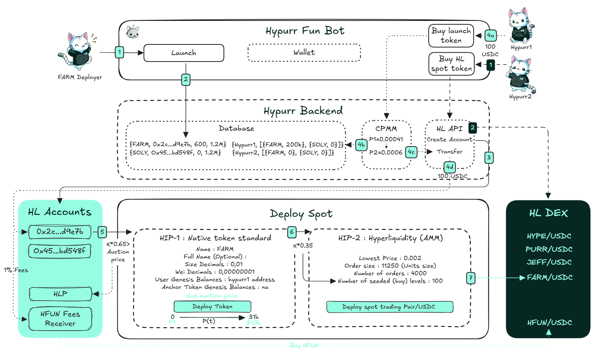

# Spot Deployments (HIP-1/HIP-2)

<figure><figcaption></figcaption></figure>

## HIP-1: Native Token Standard

### **What is HIP-1?**

**HIP-1** defines a capped-supply, fungible token standard native to **HyperCore**. When you deploy a HIP-1 token, you automatically get a built-in on-chain spot order book paired with **Spot USDC**. This enables immediate, permissionless trading without needing extra infrastructure. Think of it as launching a token and its native trading venue at the same time! 🚀

**Token Deployment:** See our [Spot Deployment Guide](../../../guide/user-guide/spot-deployments.md) for complete instructions on deploying HIP-1 tokens via Dutch auction.

***

### **Customizable Token Parameters**

#### **Name & Decimals:**

* **Name (6 chars max) & Full Name (Optional):** Give your token a short symbol and optionally a longer, more descriptive name.
* **Size Decimals:** Control minimum trade increments. For example, if your “size decimal” setting is 0.1, you cannot place an order for 1.02 tokens—it must adhere to the chosen size granularity.
* **Wei Decimals:** Define the smallest indivisible unit of your token (like “wei” for ETH). This ensures granular control over how tokens are counted and transferred.

#### Max Supply:

Set a **fixed initial supply** that can decrease over time (e.g., from trading fees or burns). This supply is hard-capped—no new tokens can be minted.

#### User Genesis Balances:

At deployment, you can **distribute initial token** balances to specific addresses. For example, you might allocate tokens to: Early buyers who participated via the “Hypurr Fun Bot”, a multisig treasury, an initial bridge mint, etc.

#### **Anchor Token Genesis:**

You can also **allocate initial balances** to holders of **another HIP-1 token** (the “anchor token”) proportionally to their holdings. This rewards a pre-existing community. For instance, if a holder possesses a certain percentage of the anchor token’s max supply at the time of genesis, they’ll receive a proportional amount of the newly deployed token—provided they meet the minimum threshold (≥0.0001% of the anchor token’s max supply).

***

### Gas & Deployment Costs

**Deployment via a 31-Hour Dutch Auction**\
HIP-1 token deployment isn’t just a standard transaction; it’s gated by a 31-hour **Dutch auction** mechanism that determines the “gas cost” in USDC. A Dutch auction starts at a high price and decreases linearly over time until a buyer steps in.

**How It Works:**

1. **Initial Price:**
   * If no one bought in the previous auction, the initial price is set to **10,000 USDC**.
   * If the previous auction did complete, the new auction’s initial price will be **2x the last winning price**.
2.  **Price Decrease over 31 Hours:**\
    The price drops linearly from its initial value down to 10,000 USDC over 31 hours.

    **Price Formula (example):**\
    &#xNAN;_&#x70;rice(t) = initial\_price - ((initial\_price - 10,000) \* (t / 31h))_

    Where _t_ is the time elapsed in hours.
3. **Single Buyer per Auction Window:**\
   Only one buyer can purchase the deployment “slot” within a given 31-hour period. Once bought, the auction ends, and you’ve reserved your right to deploy your token at any future time—you’re not forced to deploy immediately. You’ve essentially secured the ticker and the ability to create that token market.
4. **Payment in USDC, Transition to HYPE:**\
   Initially, spot deployment auctions were payable in **USDC**. Since [May 22, 2025](https://discord.com/channels/1029781241702129716/1030197017655394447/1375074372741758997), payments are made in the native Hyperliquid token (**HYPE**).

**Where to Deploy and Test:**

* **Mainnet:** [https://app.hyperliquid.xyz/deploySpot](https://app.hyperliquid.xyz/deploySpot)
* **Testnet (Recommended for Practice):** [https://app.hyperliquid-testnet.xyz/deploySpot](https://app.hyperliquid-testnet.xyz/deploySpot)

***

### EVM Compatibility

Any deployed HIP-1 token can be linked to a corresponding ERC-20 contract on the EVM side, enhancing interoperability and expanding the token’s utility beyond the native environment.

***

### Trading, Fees & Dusting Mechanism

**Trading & Fees:**

* Trading follows Hyperliquid’s standard [fee schedule](../dex/clearinghouse/fees.md).
* Non-USDC trading fees are currently burned or redirected to the deployer's address.

**Dusting Mechanism:**\
Over time, negligible token balances (“dust”) accumulate. These tiny amounts are periodically aggregated and either sold on the open market or burned if they’re too small. This keeps user accounts tidy and the ecosystem cleaner.

***

## HIP-2: Hyperliquidity

### **What is HIP-2?**

HIP-2 introduces **Hyperliquidity**, a revolutionary liquidity solution built directly into the **HyperCore**. Unlike traditional liquidity pools (e.g., Uniswap-style AMMs), Hyperliquidity uses the **on-chain order book** to provide automated two-sided liquidity for spot tokens.

***

### **Key Features**

#### **🚀 Liquidity Bootstrapping from Day One**

Launching a new token often means struggling to create liquid markets. HIP-2 solves this by providing:

* Automated **buy and sell orders** directly on the order book.
* A tight **0.3% spread** between bid and ask prices, ensuring smooth price discovery and efficient trading.
* Liquidity seeded and locked by the deployer (e.g., tokens and USDC), creating a stable trading foundation from the start.

#### **⚙️ Parameters & Customization**

When deploying a token with HIP-2, creators can set:

* **Lowest Price:** The lowest price where orders begin.
* **Number of Orders:** Determines how many orders will exist within the price range.
* **Order Size:** The quantity of tokens allocated to each order (e.g., 11,250 tokens per order).
* **Number of Seeded Levels:** Adds initial liquidity on the **buy side** (bid orders) by pre-funding the order book with USDC. This ensures trading stability from the start.

**Example Calculation**

* **Lowest Price:** $0.002
* **Number of Orders:** 4000
* **Order Size:** 11,250 tokens
* **Seeded Levels:** 100

Let’s calculate the **total cost** of seeding and the resulting **starting price**:

1. **Price Progression:** Each level's price increases by **0.3%** from the previous level. For example:
   * Level 1: $0.002
   * Level 2: $0.002 × (1 + 0.003) = $0.002006...
2. **Cost Per Level:** The cost for each level is calculated as: _Cost = Price × Order Size_
   * Level 1: $0.002 × 11,250 = $22.50
   * Level 2: $0.002006 × 11,250 ≈ $22.57
3. **Total Cost to Seed 100 Levels:** Adding the costs of all 100 levels gives **$2,619.40**.
4. **Starting Price at the Last Seeded Level:** After 100 levels, the price reaches **$0.00269**, maintaining the **0.3% incremental increase**.

<figure><figcaption>
HIP-2 Example
</figcaption></figure>

#### **🔒 Locked Liquidity**

Deployer-funded liquidity is **permanently locked** within the order book. This creates a reliable baseline for trading and protects against “rug pulls,” since the liquidity is embedded into the protocol itself.

**In our example:**

* The **$2,619.40** used to seed 100 levels is locked **forever** as USDC liquidity in the buy-side (bid orders).
* Additionally, the **4,000 orders × 11,250 tokens = 45,000,000 tokens** allocated to HIP-2 are also permanently locked on the sell side (ask orders).

#### **🛠️ User-Driven Limit Orders**

Beyond automated orders, users can manually contribute to liquidity by placing their own limit orders. These are not locked and can be adjusted or withdrawn anytime.

***

### **How Does Hyperliquidity Work?**

1. **Automated Bid & Ask Orders**\
   Hyperliquidity places orders directly on the token’s spot order book:
   * **Sell Orders (Asks):** Tokens are listed at increasing prices, starting at the lowest price set by the deployer.
   * **Buy Orders (Bids):** Funded by USDC, ensuring liquidity for token holders who wish to sell.
2. **Dynamic Refresh Every 3 Seconds**\
   Orders are updated every \~3 seconds, ensuring the bid-ask spread remains at **0.3% or tighter**. This refresh cycle is built into the L1 protocol and occurs at every block transition.
3. **No Middlemen, No External Operators**\
   Unlike traditional market-making systems, Hyperliquidity operates autonomously, directly leveraging the chain’s core logic. It eliminates the risks of third-party manipulation or mismanagement.

***

### **Potential Risks to Be Aware Of**

While HIP-2 is powerful, it’s important to set parameters thoughtfully:

* **Insufficient Seeded Levels:** Without enough USDC, the protocol may struggle to sustain bid orders, leaving the token “under HIP-2.”
* **Misconfigured Parameters:** Deployers must carefully balance the number of orders, order size, and seeded levels to ensure adequate liquidity.
* **High Sell-Side Volume:** Large airdrops or token distributions can drain USDC liquidity if too many users sell at once.

***

#### **References**

This guide was created using information from the following sources:

* The official Hyperliquid documentation: [Hyperliquid Improvement Proposals (HIPs)](https://hyperliquid.gitbook.io/hyperliquid-docs/hyperliquid-improvement-proposals-hips)
* The article _"Art of Understanding Liquidity in Crypto"_ by Derteil Crypto: [Medium Post](https://medium.com/@derteilcrypto/art-of-understanding-liquidity-in-crypto-0eb1d105cdb0)
* Insights shared by King Julian on Twitter: [Tweet](https://x.com/KingJulianIAm/status/1813397274237546499)

For more details and further reading, feel free to explore these resources! 📚
