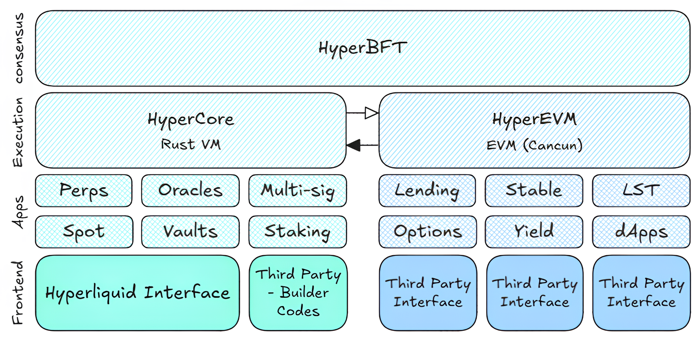

# Overview

**Welcome to the core of Hyperliquid’s technology stack!** Here, we’ll provide both a high-level overview and a deeper technical dive into the blockchain, its consensus mechanism, and the native components that make Hyperliquid a high-performance and innovative ecosystem.

### High-Level Diagram

<figure><figcaption>
<a href="https://x.com/chameleon_jeff/status/1898739434000191823">Hyperliquid = HyperCore + HyperEVM</a>
</figcaption></figure>

### Core Components

#### **HyperBFT Consensus:**

* A consensus algorithm that ensures network nodes agree on the current state of the blockchain.
* Permissionless network - anyone can become a validator, with the number of active validators increasing over time, making decentralization increasingly real
* The codebase for the Hyperliquid L1 has not yet been publicly released but will be when it's secure to do so.

#### HyperCor&#x65;**:**

A **custom, from-scratch Layer 1 blockchain** designed to power Hyperliquid’s flagship application—its decentralized exchange (DEX). It aims to achieve **up to 200,000 TPS** and **latency under 0,1 second**, far surpassing traditional blockchain performance metrics.

**Divided into Six Primary “Blocks”:**

1. **Native Order Book:**
   * **Fully On-Chain:** All orders, trades, funding rates, and liquidations are recorded transparently on-chain.
   * **Gas-Free Orders & Leverage:** Place orders without gas fees and access up to **40x leverage** on perpetuals.
   * **Seamless UX:** One-click trading without repeated wallet approvals for a streamlined experience.
2. **Clearinghouse**
   * **Core Exchange State Management:** The Clearinghouse manages all user states for both perpetual and spot trading.
   * **Perpetuals:** Handles cross-margin balances and positions, with optional isolated margin support to allocate specific collateral to individual positions, reducing risk exposure.
   * **Spot Trading:** Similarly manages token balances and holds for spot trading, ensuring accurate and efficient account states across the platform.
3. **Oracles:**&#x20;
   * **Accurate Market Data:** Integrated price feeds ensure reliable and fair pricing for both spot and perpetual markets.
   * **High-Frequency Updates:** Updated rapidly to match the speed and precision of Hyperliquid’s platform.
4. **Vaults:**&#x20;
   * **Liquidity & Protection:** Mechanisms like **HLP** (Hyperliquid Liquidity Provider) tokens and an **AF** (Assistance Fund) safeguard against volatility and liquidation risks.
   * **Fee Redistribution:** Trading fees are redistributed to liquidity providers, creating strong incentives for market participation.
5. **Spot Tokens (HIP-1 & HIP-2)**
   * **Easy Token Launches (HIP-1):** Deploy native spot tokens with a built-in on-chain order book for transparent, secure trading from day one.
   * **Integrated Liquidity (HIP-2):** Achieve “Hyperliquidity” with a mechanism inspired by Uniswap, tailored for order-book trading, ensuring dynamic and reliable liquidity for smoother price discovery.
6. **Multi-Sig:**
   * **Native multi-signature support** built directly into HyperCore as a blockchain primitive, not requiring smart contracts
   * **Enhanced security** through multiple private keys controlling a single account with customizable signature thresholds
   * **Flexible configuration** allowing up to 10 authorized users per multi-sig account with updateable permissions

#### **HyperEVM:**&#x20;

* The HyperEVM layer enables users to build and deploy their own applications, launch tokens, and access all of these financial primitives in one unified environment.
* High performance, native financial components, and EVM compatibility make it possible to build apps that require all three: **performance**, **liquidity**, and **programmability** in one place.
