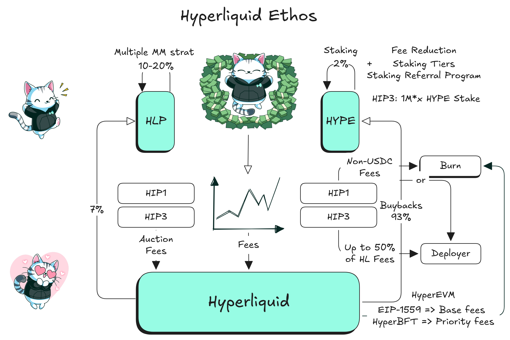

# Hyperliquidated

_"I will introduce you to the newest emerging cult on CT, or who I will be referring to as..._\
&#xNAN;_**'The Hyper Liquidated'**"_ – [_@crypto\_adair_](https://x.com/crypto_adair/status/1806748433593577833)

The **Hyper Liquidated** community is a rapidly growing ecosystem of passionate traders, builders, and crypto enthusiasts who rally around the capabilities and innovation of the **HyperLiquid** platform. From experienced market-makers to new entrants exploring the world of perps, and beyond, everyone is coming together to celebrate a platform that truly resonates with their needs and ambitions.

***

### Why Does the Community Love HyperLiquid?

<figure><figcaption>
Hyperliquid Ethos in Action: How <a href="../../architecture/hypercore/vault.md">HLP</a>, <a href="../../architecture/hypercore/hips/spot-deployments-hip-1-hip-2.md#gas-and-deployment-costs">HIP1</a>, <a href="../../architecture/hypercore/hips/perp-deployments-hip-3.md">HIP3</a>, and <a href="../../architecture/hyperevm.md#how-it-works">HyperEVM</a> Align with a Community-First Vision
</figcaption></figure>

* **Product-Market Fit:** Multiple traders, including big names like [@HsakaTrades](https://x.com/HsakaTrades), [@DaanCrypto](https://x.com/DaanCrypto) and [@ThinkingUSD](https://x.com/ThinkingUSD) have publicly shared their appreciation for HyperLiquid.
* **User-Centric Growth:** The HyperLiquid team is committed to fostering and expanding the community. They’re constantly working to improve the product, respond to feedback, and create an environment where users can thrive.
* **Shared Success:** It’s not just a platform—it’s a network of people helping each other navigate markets, share insights, and grow together.
