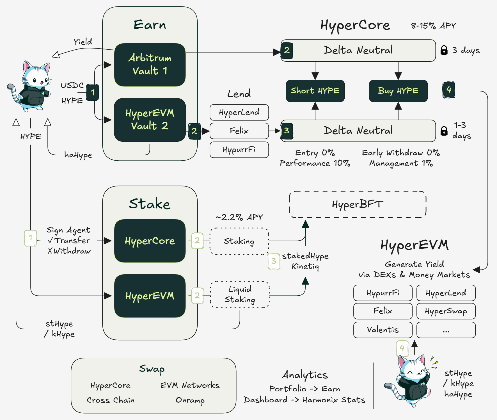

# Harmonix

Harmonix transforms idle capital into productive liquidity for the Hyperliquid ecosystem through automated strategies and composable yield tokens.

[Website](https://harmonix.fi/) | [Twitter](https://x.com/harmonixfi) | [Discord](https://discord.com/invite/sNgbWFJ9Bw) | [Telegram](https://t.me/harmonix_chat) | [Documentation](https://harmonix-finance.gitbook.io/harmonix-docs) | [Blog](https://mirror.xyz/0xBc76Ef781235ed6d9e58e566dD07fdB32b6bEF04) | [Tuto](https://harmonix-finance.gitbook.io/harmonix-docs/tutorials/how-to-get-started)

<figure><figcaption></figcaption></figure>

### The Vision

After FTX's collapse, Harmonix emerged with a clear mission: build a **decentralized hedge fund** where users maintain full control while accessing institutional-grade strategies. Unlike Alameda which extracted value, Harmonix reinforces the ecosystem it operates in.

Founded by **Frank Dang** (6 years investment banking, built $50M TVL aggregator) and **Bean Nguyen** (10 years in tech, quantitative model developer), the team brings traditional finance expertise to DeFi innovation. Starting in 2020 with quantitative models for Bean's Singapore team, they evolved to pioneer the Option Wheel strategy on Deribit in 2022 before focusing on Hyperliquid.

**Core principle**: Every dollar deposited strengthens Hyperliquid's liquidity infrastructure while generating sustainable yield for users.

### Core Products

#### USDC-HYPE Delta Neutral Vault (Live on HyperCore)

The flagship vault delivering **8-15% APY** on stablecoins - one of the highest sustainable yields in DeFi.

* **What is Delta-Neutral?** A strategy that earns yield without betting on price direction. You're **market neutral** - making money whether prices go up or down through funding rate capture.
* **How your money works:** • Deposit USDC → Strategy buys spot HYPE + opens equal short position • Earn from positive funding rates (longs pay shorts) • Withdraw anytime with your principal + accumulated yield
* **Real costs to consider:** • Entry: \~0.08% (trading fees + slippage) • Performance fee: 10% on profits only • **Key insight**: Stay deposited at least 2 weeks to offset entry costs

**Track performance**: [Live Dashboard](https://app.harmonix.fi/dashboards/ba33d0f9-aa1f-4b59-af87-d0751ccb4dd3) | [Source: Strategy Details](https://harmonix-finance.gitbook.io/harmonix-docs/product-harmonix-finance/overview-strategies/hyperliquid-usdc-hype-delta-neutral-vault)

#### $HYPE Vault on HyperEVM (Launching July 2025)

The next evolution: deposit HYPE, receive **haHYPE** - a yield-bearing token that grows in value automatically.

**The delta-neutral strategy in action:**

1. You deposit 100 HYPE
2. Vault uses HYPE as collateral on Felix Protocol to borrow feUSD
3. Converts feUSD → USDC for the hedging strategy
4. Capital splits for perfect balance:
   * **50% shorts HYPE** on HyperCore (earning funding rates)
   * **50% buys back HYPE** for deployment in HyperEVM DeFi
5. Result: Zero price exposure, pure yield generation

**What you earn:**&#x20;

* **Funding rate yield**: 10-15% APR from the short position
* **DeFi protocol yields**: From staking and liquidity provision across HyperEVM&#x20;
* **Arbitrage opportunities**: feUSD ↔ USDC price differences captured automatically
* **Felix liquidation bonuses**: Additional HYPE rewards when prices decline
* **Ecosystem points**: Felix, Harmonix, and partner protocol rewards
* **Future haHYPE strategies**: Additional yield from looping mechanisms

**Fees (only charged at withdrawal):** • Management: 1% annually (pro-rated) • Performance: 10% on net profits • **Key insight**: Stay at least 7 days to ensure yield covers fees

**Track performance**: [Live Dashboard](https://app.harmonix.fi/vaults/hyperevm-delta-neutral-hype-v3) | [Source: Yield Sources](https://harmonix-finance.gitbook.io/harmonix-docs/product-harmonix-finance/overview-strategies/usdhype-vault-on-hyperevm) | [Kitty Tuto](https://x.com/harmonixintern/status/1939243780915474698)

#### Understanding haHYPE (Yield-Bearing Token)

When you deposit into the HYPE vault, you receive haHYPE - think of it as a **receipt that grows in value**.

**Key benefits for users:**

* **Auto-compounding**: No need to claim or restake - value increases automatically (your haHYPE balance stays the same)
* **Transferable**: Send to friends, trade on DEXs, or use in other protocols&#x20;
* **Collateral potential**: Soon usable for borrowing across HyperEVM
* **Flexible withdrawals**: Request anytime (processing time 1-3 days)

**Planned integrations:** • Liquidity pools on Hyperswap (haHYPE/HYPE pairs) • Borrowing markets on Timeswap and Hyperlend • Yield tokenization on Napier Finance

**Track haHYPE**: [YBT Properties](https://harmonix-finance.gitbook.io/harmonix-docs/product-harmonix-finance/yield-bearing-token)

### Staking Solutions

#### HyperCore: Validator Staking

Harmonix curates the best validators for HYPE staking with enhanced rewards:

**Selected Validators & Rewards:** • **Alphaticks** - 0% commission + 3× Harmonix Points (best for maximum yield) • **ValiDAO** - Standard APY + 2× Harmonix Points + exclusive ValiDAO Points • **HypurrCollective x Nansen** - Community validator + Nansen analytics rewards • **ASXN** - Algorithm-focused validator with research benefits

**Current staking APY**: \~2.2% base + additional point multipliers

#### HyperEVM: Liquid Staking & DeFi

Access liquid staking through **stHYPE** (StakedHype) - stake your HYPE while maintaining liquidity for DeFi activities. Soon, **kHYPE** (Kinetiq) will offer additional staking options.

**How stHYPE enhances your yield:** Once you receive stHYPE tokens, use them across HyperEVM protocols:

* **Felix** - Use stHYPE as collateral to borrow feUSD
* **Hyperlend** - Lend your stHYPE for additional APY
* **Hyperswap** - Provide liquidity in stHYPE pools
* **Valantis** - Access specialized stHYPE AMM strategies
* **HypurrFi** - Create leveraged positions with [isolated lending markets](https://x.com/harmonixfi/status/1937000845175914514)

**One-click access**: Harmonix aggregates these opportunities in a single [interface](https://app.harmonix.fi/stake).

### Security & Protection

* **Audits completed**: 3 (Verichains x2, Shieldify) | **Upcoming audits**: Zenith and Code4Arena before token launch
* **Smart contract design**: Non-upgradeable core logic prevents tampering
* **Fund protection**: Multi-signature controls and automated risk monitoring
* **User control**: Permissionless deposits and withdrawals - your funds, your keys

[Security Details](https://harmonix-finance.gitbook.io/harmonix-docs/security-and-risk)

#### Harmonix Points: Your Proof of Contribution

**Season 2 is live** (March 4) with enhanced rewards:

* Points earned through vault deposits, staking, and protocol usage
* **Tiered system**: Bronze, Silver, Gold, Diamond (top 2% get 50% fee rebates)
* **Loyalty bonus** for Season 1 participants + time-weighted rewards
* Future utility: NFT rewards, performance fee rebates, early access to features

**Points formula** rewards both deposit size and time commitment - early users maintain their advantage while new participants can climb the ranks.

[Full details on Season 2](https://harmonix-finance.gitbook.io/harmonix-docs/referral-and-point/harmonix-point-program) | [Season 2 Announcement](https://x.com/harmonixfi/status/1896810760787071304)

#### Roadmap Highlights

**July 2025**: HYPE Vault launch with $5M cap + haHYPE distribution **Q3 2025**: BTC & ETH vaults via HyperUnit + instant withdrawals **Q4 2025**: Developer SDK for external builders + native lending market

**Coming later in 2025**: ~~Spot Swap feature~~, Curator System (community strategies), GameFi pets

[Full 2025 Roadmap](https://x.com/harmonixfi/status/1929365326036189611) | [Extended Vision](https://x.com/harmonixfi/status/1875626474449027073)

***

### Resources & Further Reading

* Team: [@christophorusan](https://x.com/christophorusan) | [@harmonixintern](https://x.com/harmonixintern)
* Key Deep Dives:
  * [2025 Strategic Vision](https://x.com/harmonixfi/status/1926265822223184067)
  * [Beyond Simplicity: Vault vs. DIY](https://x.com/harmonixfi/status/1937829024279200129)
  * [YBT: Building Block for Growth](https://x.com/harmonixfi/status/1935641817820844488)
  * [Points System & Proof of Contribution](https://x.com/harmonixfi/status/1932744444891275565)
  * [Community Analysis by @RBCHI](https://x.com/RBCHI/status/1938309996011470951)

***

### The Bottom Line

Harmonix creates a **liquidity loop** where user profits strengthen Hyperliquid:

* Every deposit increases open interest on HyperCore
* Strategies deepen liquidity across Felix, Hyperlend, and Hyperswap
* YBTs like haHYPE become shared collateral reducing bridged asset dependency
* Result: Sustainable yields that compound within the ecosystem

**The endgame**: Liquidity that works for users AND the protocol - positioned to win through alignment, not extraction.
