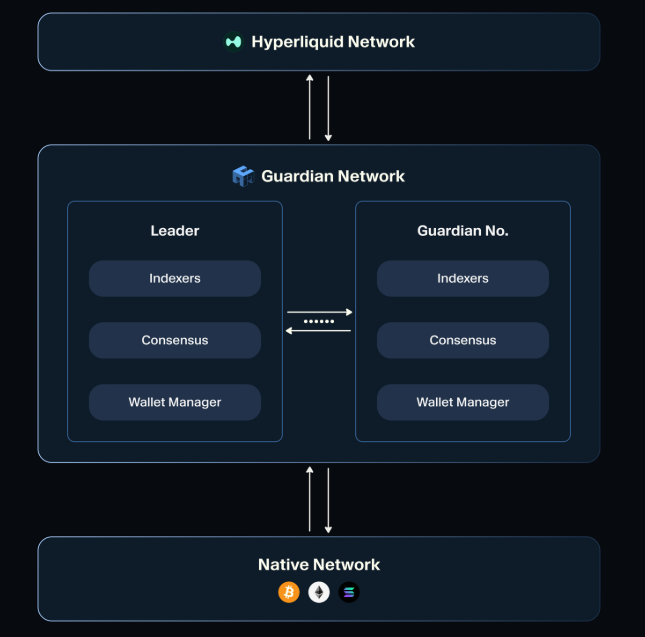

# Kinetiq

Kinetiq transforms locked HYPE into liquid, yield-bearing kHYPE tokens while maintaining full staking rewards and DeFi composability.

[Website](https://kinetiq.xyz/) | [Twitter](https://x.com/kinetiq_xyz) | [Discord](https://discord.com/invite/kinetiq) | [Telegram](https://t.me/kinetiq_announcements) | [Documentation](https://docs.kinetiq.xyz/)

<figure><figcaption></figcaption></figure>

### The Core Product

**kHYPE Liquid Staking Token** Stake HYPE, receive kHYPE - a liquid token that grows in value automatically while unlocking DeFi opportunities.

* **Same staking APY**: \~2.2% base yield
* **Auto-compounding**: kHYPE value increases automatically, no claiming needed
* **Instant liquidity**: Trade or use kHYPE across Hyperliquid DeFi immediately
* **Automated delegation**: StakeHub selects top-performing validators automatically

**Key difference from native staking:**

* **You lose** (at least for the moment): HyperCore [Staking Tiers benefits](https://hyperliquid-co.gitbook.io/wiki/architecture/hypercore/dex/clearinghouse/fees#fee-tiers) and [Staking Referral Program](https://hyperliquid-co.gitbook.io/wiki/architecture/hypercore/dex/clearinghouse/fees#staking-referral-program)
* **You gain**: Full liquidity + DeFi composability + automated validator management

### Staking Tiers Impact Analysis

**Important consideration:** Liquid staking means you forfeit HyperCore trading fee discounts. Here's the breakeven analysis:

| Tier Level | HYPE Staked | Value ($)  | Break-even APR 5k$/month | Break-even APR 20k$/month | Break-even APR 100k$/month |
| ---------- | ----------- | ---------- | ------------------------ | ------------------------- | -------------------------- |
| Wood       | 10          | 500        | 1.80%                    | 7.20%                     | 36.00%                     |
| Bronze     | 100         | 5,000      | 0.36%                    | 1.44%                     | 7.20%                      |
| Silver     | 1,000       | 50,000     | 0.05%                    | 0.22%                     | 1.08%                      |
| Gold       | 10,000      | 500,000    | 0.01%                    | 0.03%                     | 0.14%                      |
| Platinum   | 100,000     | 5,000,000  | 0.001%                   | 0.004%                    | 0.022%                     |
| Diamond    | 500,000     | 25,000,000 | 0.0003%                  | 0.001%                    | 0.006%                     |

**Formula**: Break-even APR = (Monthly\_volume × 0.003 × Tier\_discount × 12) / Staked\_value × 100

**Bottom line**: For small accounts with moderate trading activity, liquid staking isn't necessarily optimal from a pure APY perspective.

_**Note**: This analysis doesn't include Staking Referral Program rewards, which can be substantial additional income lost when using liquid staking._

### How to Use kHYPE

**Getting Started:** • Minimum stake: 5 HYPE • Transfer HYPE from HyperCore to HyperEVM via Portfolio → "Transfer to EVM" • Stake through Kinetiq dApp to receive kHYPE

**Unstaking Options:**

* **Direct unstaking**: 7-day waiting period + **0.10% fee** (avoid if possible)
* **Instant trading**: Swap kHYPE on liquid markets - **recommended method** (captures all auto-compounded rewards without fees)
* **24-hour delay**: New stakes have 24h withdrawal restriction

**Available Trading Venues:** • **Laminar (EVM)**: kHYPE/HYPE pairs • **Curve (EVM)**: kHYPE/HYPE stable pools • **kHYPE AMM by Valantis**: Native HYPE pairs • **Project X (EVM)**: kHYPE/HYPE trading • **HyperCore**: Coming soon

### DeFi Integration & Yield Stacking

**kHYPE Composability:** • **Collateral**: Use in Felix (feUSD), HypurrFi (USDXL), Hyperlend • **Liquidity pools**: Pair with HYPE, USDC on various DEXs • **Automated strategies**: Veda's kHYPE Earn vault

**Kinetiq Earn Vault (by Veda):**

* **Managed by Seven Seas**: >$3.7B TVL track record
* **Auto-yield optimization**: Curve LP, leveraged staking, protocol farming&#x20;
* **Fees**: 2% annual platform fee (pro-rated), no performance/entry/exit fees
* **Risk-adjusted**: Vetted protocols, audit reviews, diversified strategies

### StakeHub: Automated Validator Selection

**How StakeHub works:**

* **Real-time scoring**: Validators rated 0-100 based on performance
* **Automatic rebalancing**: Stake flows to top-performing validators
* **Five scoring factors**: Reliability, Security, Economics, Governance, Longevity
* **On-chain oracle**: Transparent, verifiable validator data

**Benefits for users:** • No manual validator research or monitoring • Continuous optimization for best returns • Reduced risk from underperforming validators • Full transparency via on-chain data

### Security & Considerations

**Audits completed:** Spearbit, Zenith, Pashov Audit Group, Code4rena competition

**Key risks to understand:** • **Smart contract risk**: Despite multiple audits, vulnerabilities possible • **kHYPE price risk**: May trade below intrinsic value during high withdrawal periods • **Slashing risk**: Currently none on Hyperliquid, but may be introduced • **Opportunity cost**: Missing HyperCore staking tier benefits

**Vault-specific risks (Earn):** • **Impermanent loss**: From liquidity provisioning strategies • **Liquidation risk**: From leveraged positions • **Protocol risk**: Smart contract vulnerabilities in underlying DeFi protocols

### kPoints Rewards Program

**Current system:**

* **Launch date**: July 15, 2025
* **Distribution**: 800,000 kPoints weekly (snapshots Tuesday, distributed Thursday)
* **Earning activities**: Staking, vault participation, ecosystem usage
* **Future utility**: Expected fee rebates, governance, exclusive access

### Institutional Product: iHYPE

**Coming soon**: Institutional-grade liquid staking solution • **Partners**: IMC Trading, Flowdesk, qualified custodians • **Compliance focus**: Enterprise-grade access with regulatory clarity • **Audit pipeline**: Security reviews and operational integrations underway - [Source](https://x.com/kinetiq_xyz/status/1935766396496945561)

### The Bottom Line

**Kinetiq creates value through:**

* **Liquid staking**: Maintain DeFi flexibility while earning staking rewards
* **Automated optimization**: StakeHub handles validator selection and rebalancing
* **Yield stacking**: Combine staking rewards with DeFi opportunities
* **Network benefits**: Improved decentralization through automated delegation

**In conclusion**: Liquid staking benefits most users, but understanding the trade-offs is essential. Evaluate your trading patterns and DeFi strategy before switching.
