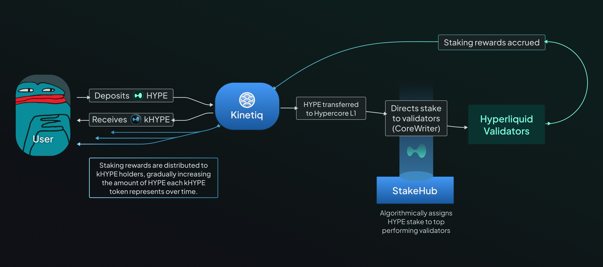

# Kinetiq

Kinetiq transforms locked HYPE into liquid, yield-bearing tokens through two core products: **kHYPE** (liquid staking) and **Launch** (HIP-3 exchange deployment).

[Website](https://kinetiq.xyz/) | [Twitter](https://x.com/kinetiq_xyz) | [Discord](https://discord.com/invite/kinetiq) | [Telegram](https://t.me/kinetiq_announcements) | [Documentation](https://docs.kinetiq.xyz/)

<figure><figcaption></figcaption></figure>

### kHYPE: Liquid Staking Token

#### The Core Product

Stake HYPE, receive kHYPE - a liquid token that grows in value automatically while unlocking DeFi opportunities.

* **Same staking APY**: \~2.2% base yield
* **Auto-compounding**: kHYPE value increases automatically, no claiming needed
* **Instant liquidity**: Trade or use kHYPE across Hyperliquid DeFi immediately
* **Automated delegation**: StakeHub selects top-performing validators automatically

**Key difference from native staking:**

* **You lose** (at least for the moment): HyperCore [Staking Tiers benefits](https://hyperliquid-co.gitbook.io/wiki/architecture/hypercore/dex/clearinghouse/fees#fee-tiers) and [Staking Referral Program](https://hyperliquid-co.gitbook.io/wiki/architecture/hypercore/dex/clearinghouse/fees#staking-referral-program)
* **You gain**: Full liquidity + DeFi composability + automated validator management

#### Staking Tiers Impact Analysis

**Formula**: Break-even APR = (Monthly\_volume × 0.0003 × Tier\_discount × 12) / Staked\_value × 100\
Break-even APR = rate required on the LST to offset the loss of hyperCore profits.

| Tier Level | HYPE Staked | Value ($)  | Break-even APR 5k$/month | Break-even APR 20k$/month | Break-even APR 100k$/month |
| ---------- | ----------- | ---------- | ------------------------ | ------------------------- | -------------------------- |
| Wood       | 10          | 500        | 0.18%                    | 0.72%                     | 3.60%                      |
| Bronze     | 100         | 5,000      | 0.036%                   | 0.144%                    | 0.72%                      |
| Silver     | 1,000       | 50,000     | 0.0054%                  | 0.022%                    | 0.108%                     |
| Gold       | 10,000      | 500,000    | 0.0007%                  | 0.003%                    | 0.014%                     |
| Platinum   | 100,000     | 5,000,000  | 0.0001%                  | 0.0004%                   | 0.002%                     |
| Diamond    | 500,000     | 25,000,000 | 0.00003%                 | 0.0001%                   | 0.0006%                    |

**Bottom line**: For small accounts with moderate trading activity, liquid staking isn't necessarily optimal from a pure APY perspective.

_**Note**: This analysis doesn't include Staking Referral Program rewards, which can be substantial additional income lost when using liquid staking._

#### How to Use kHYPE

**Getting Started:**&#x20;

* Minimum stake: 5 HYPE&#x20;
* Transfer HYPE from HyperCore to HyperEVM via Portfolio → "Transfer to EVM"
* Stake through Kinetiq dApp to receive kHYPE

**Unstaking Options:**

* **Direct unstaking**: 7-day waiting period + **0.10% fee** (avoid if possible)
* **Instant trading**: Swap kHYPE on liquid markets - **recommended method** (captures all auto-compounded rewards without fees)
* **24-hour delay**: New stakes have 24h withdrawal restriction

**Available Trading Venues:** • **Laminar (EVM)**: kHYPE/HYPE pairs • **Curve (EVM)**: kHYPE/HYPE stable pools • **kHYPE AMM by Valantis**: Native HYPE pairs • **Project X (EVM)**: kHYPE/HYPE trading • **HyperCore**: Coming soon

#### DeFi Integration & Yield Stacking

**kHYPE Composability:**

* **Collateral**: Use in Felix (feUSD), HypurrFi (USDXL), Hyperlend
* **Liquidity pools**: Pair with HYPE, USDC on various DEXs
* **Automated strategies**: Veda's kHYPE Earn vault

**Kinetiq Earn Vault (by Veda):**

* **Managed by Seven Seas**: >$3.7B TVL track record
* **Auto-yield optimization**: Curve LP, leveraged staking, protocol farming&#x20;
* **Fees**: 2% annual platform fee (pro-rated), no performance/entry/exit fees
* **Risk-adjusted**: Vetted protocols, audit reviews, diversified strategies

#### StakeHub: Automated Validator Selection

**How StakeHub works:**

* **Real-time scoring**: Validators rated 0-100 based on performance
* **Automatic rebalancing**: Stake flows to top-performing validators
* **Five scoring factors**: Reliability, Security, Economics, Governance, Longevity
* **On-chain oracle**: Transparent, verifiable validator data

**Benefits for users:** • No manual validator research or monitoring • Continuous optimization for best returns • Reduced risk from underperforming validators • Full transparency via on-chain data

***

### Launch: HIP-3 Exchange-as-a-Service

**What is Launch?**\
The platform enabling **permissionless deployment** of perpetual futures exchanges through HIP-3, without the 500k HYPE capital barrier. Teams can crowdfund the required stake while focusing on market curation and community building.

#### How It Works

**1. Crowdfund the Stake**

* Contributors pool HYPE into exchange-specific staking contracts
* Receive **exLSTs** (exchange-specific liquid staking tokens)
* Each exchange has its own isolated token (e.g., exA-HYPE for Exchange A)

**2. Deploy Your Exchange**

* Kinetiq handles validator setup, smart contracts, and HyperCore integration
* Deployers focus on market selection, branding, and growth

**3. Risk Isolation**

* **Separate pools** for each exchange deployment
* **Slashing events** only affect the specific exchange pool
* Contributors' risk limited to exchanges they explicitly back

#### The "Shopify × Kickstarter" Model

* **Infrastructure** (Shopify): Complete tech stack without building from scratch
* **Capital** (Kickstarter): Community crowdfunding for the 500k HYPE requirement
* **Focus**: Deployers concentrate on markets, traders, and community

#### Benefits by Role

**For Deployers**

* Avoid \~$25M capital lockup (at a price of $50 per hype)
* Focus on market curation and community building

**For HYPE Contributors**

* Back specific exchanges aligned with your interests
* Earn yield from successful deployments
* Diversify across multiple exLSTs with isolated risk

**For Traders**

* Access specialized markets not available on main exchange
* Benefit from competitive fees and innovative products
* Support community-driven market creation

#### Important Considerations for LST Providers

**Slashing Risk**

* Deployer stakes subject to validator slashing for malicious behavior
* **Carefully diligence** deployers before contributing
* Consider requiring **self-bonding** from deployers (skin in the game)

**Risk Factors**

* Smart contract risk despite audits
* Deployer competence and key management
* Market quality and oracle reliability
* Potential total loss if deployer severely mismanages

***

### Security & Audits

* **Completed audits**: Spearbit, Zenith, Pashov Audit Group, Code4rena
* **Institutional product** (iHYPE): IMC Trading, Flowdesk partnerships - [Source](https://x.com/kinetiq_xyz/status/1935766396496945561)
* **kPoints program**: 800,000 weekly distribution for ecosystem participation (Launch date: July 15, 2025)

### The Bottom Line

Kinetiq creates two distinct value propositions:

**kHYPE**: Liquid staking for individual HYPE holders seeking DeFi flexibility\
**Launch**: Infrastructure for teams to deploy HIP-3 exchanges without massive capital requirements

Both products leverage Kinetiq's LST technology while serving different market needs - individual stakers vs. exchange deployers - with appropriate risk isolation between products.
