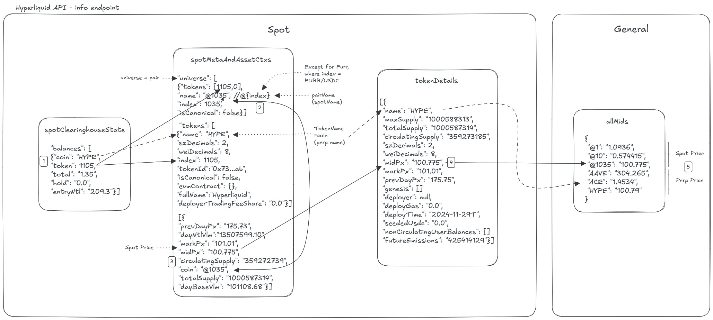

---
layout:
  title:
    visible: true
  description:
    visible: false
  tableOfContents:
    visible: true
  outline:
    visible: true
  pagination:
    visible: true
---

# Spot

The **Spot** section of the `/info` endpoint provides details about **L1 Spot markets** on Hyperliquid. To make sense of the data structure, I have created the diagram below to visually represent the relationships between key objects.

🔗 **For full API details:** [Spot Endpoint Documentation](https://hyperliquid.gitbook.io/hyperliquid-docs/for-developers/api/info-endpoint/spot)

<figure><figcaption></figcaption></figure>

**📌 Understanding Asset IDs in the Spot API**

Interpreting asset identifiers across the different API responses can be confusing. The diagram above helps clarify these relationships.

* The **"token"** field in `spotClearinghouseState` (e.g., `"token": 1105`) corresponds to the **index of that token ID in** **the** `"token"` **array of** `spotMeta`. You can find more details about the token in this **category** of data.
* Additionally, each asset is part of a **trading pair**, which is represented under `universe`.

**🔹 Key Points**

* All **universe indexes** are **numbers**, except **PURR/USDC**, which is an exception.
* The `"name"` field in `universe` is **@{index}**, but this index **differs from the token index** in `spotMeta`. Each trading pair has its **own unique index** within the `universe`.
* The `"name"` field in `tokens` represents the **coin (perp name)** of the asset.

**🔹 Spot Asset ID Calculation**

For spot endpoints, the **asset ID** is derived as follows:

```plaintext
spot_asset_id = 10000 + spotInfo["index"]
```

Where `spotInfo` is the object containing the desired **quote** and **base** tokens.

**Example: HYPE Token Asset IDs**

|              | **Mainnet** | **Testnet** |
| ------------ | ----------- | ----------- |
| **Token ID** | `150`       | `1105`      |
| **Spot ID**  | `107`       | `1035`      |

This distinction is crucial when submitting orders or querying data.
