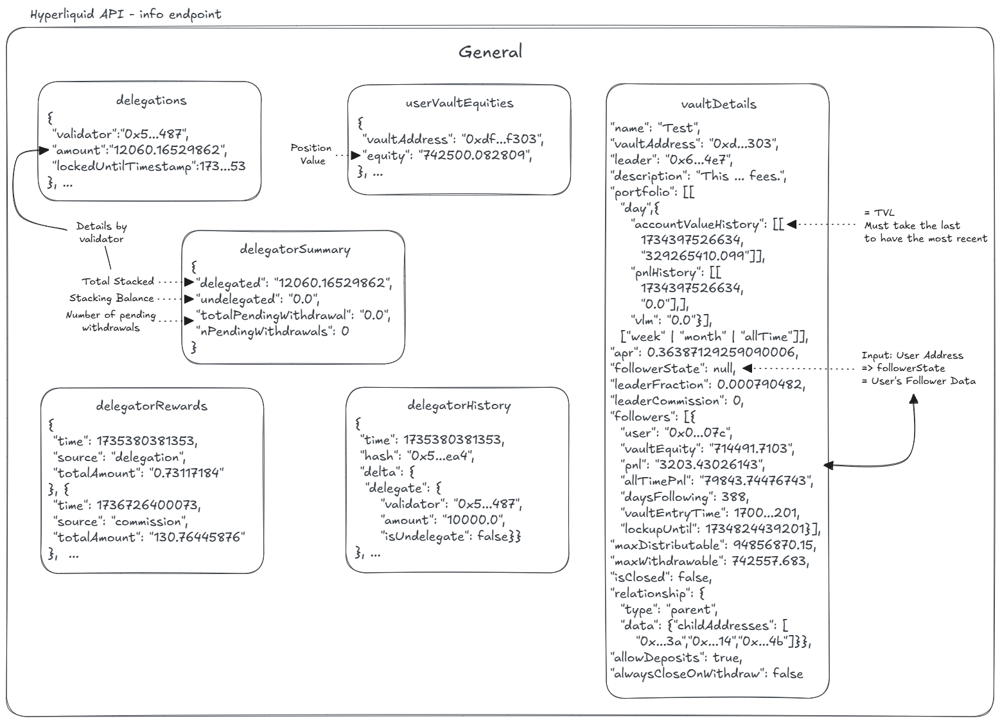

# Info

The **General** section of the `/info` endpoint provides essential system-wide data that is not specific to Spot or Perpetuals. This includes market-wide metrics, exchange status, and user-related details.

🔗 **For full API details:** [Info Endpoint Documentation](https://hyperliquid.gitbook.io/hyperliquid-docs/for-developers/api/info-endpoint)

<figure><figcaption></figcaption></figure>

_The current diagram focuses on **vault and staking-related endpoints**, but additional sections will be added soon, including:_

* **Market Data**
  * **L2 Book Snapshot**
  * **Candle Snapshot**
* **User-Specific Data**
  * **User Order History**
  * **Builder Fee**
  * **User Rate Limits**
