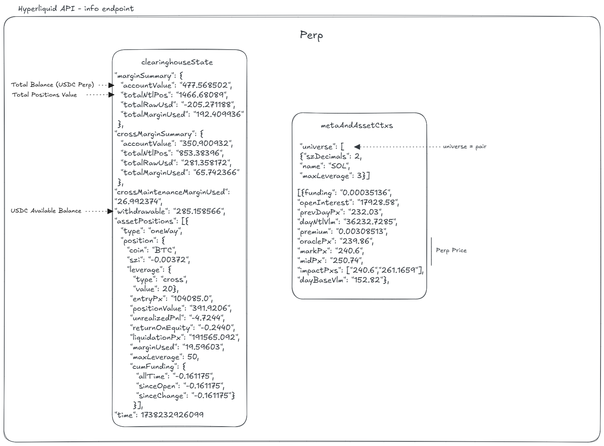

---
layout:
  title:
    visible: true
  description:
    visible: false
  tableOfContents:
    visible: true
  outline:
    visible: true
  pagination:
    visible: true
---

# Perpetuals

The **Perpetuals** section of the `/info` endpoint provides key data related to **perpetual futures** trading on Hyperliquid. The diagram below visually represents the structure of the API response for easier understanding.

🔗 **For full API details:** [Perpetuals Endpoint Documentation](https://hyperliquid.gitbook.io/hyperliquid-docs/for-developers/api/info-endpoint/perpetuals)

<figure><figcaption></figcaption></figure>

_This section is not fully done yet. Further explanations and details will be added soon._

Additionally, the Perpetuals API includes several important endpoints that are not yet covered in the diagram:

* **Funding Rates:**
  * Retrieve **historical** funding rates.
  * Retrieve **predicted** funding rates for different venues.
  * Retrieve a **user's funding history** or non-funding ledger updates (includes deposits, transfers, and withdrawals via `userNonFundingLedgerUpdates`).
* **Open Interest Caps:**
  * Query perps **approaching open interest caps**.
