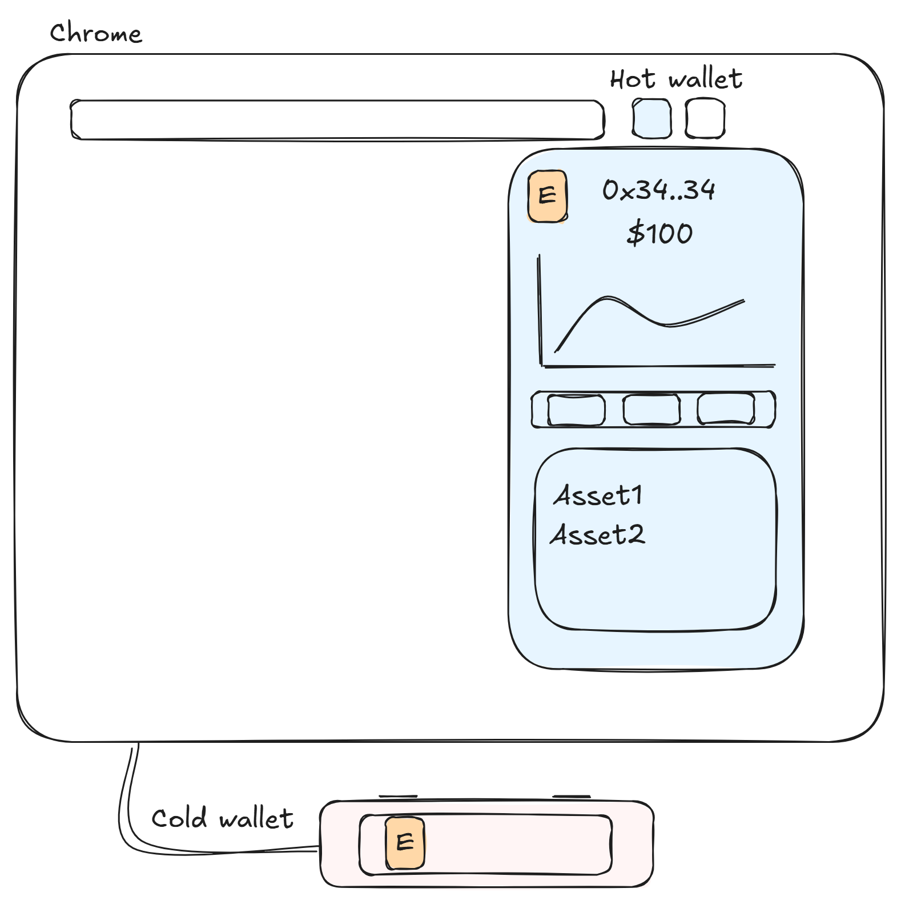

# Security Guide

**Understanding wallet security** is crucial for protecting your assets on Hyperliquid. This guide covers essential security practices and Hyperliquid-specific considerations.

### Wallet Types and Security Levels

<figure><figcaption></figcaption></figure>

**Hot Wallets** (Browser Extensions)

* **Recommended**: Rabby Wallet for superior security UX
* Features that protect users from themselves:
  * Site popularity warnings before connecting
  * Address whitelisting for transfers
  * Clear transaction display before signing
  * Smart contract approval management
* Alternatives: MetaMask, Phantom (less security-focused UX)
* **Key principle**: Hot wallets store private keys on your device - convenient but vulnerable

**Hardware Wallets** (Cold Storage)

* Popular options: **Ledger** or **Trezor**
* Store private keys offline on a physical device
* Connect to browser extensions for dApp interaction
* **Never import hardware wallet seed phrases** into browser extensions - this defeats the purpose
* Use the "Connect Hardware Wallet" option in your browser extension instead

**Multi-Wallet Strategy**

* **Trading wallet**: For daily interactions and dApp connections (accept higher risk)
* **Storage wallet**: Only for transfers, never connect to dApps (maximum security)
* **Consider separate hardware wallets** for each purpose
* Keep majority of funds in storage wallet, move only what you need to trading wallet

### Hyperliquid-Specific Security

**Agent Wallets** (Unique to Hyperliquid)

* Hyperliquid uses **delegated signing** through agent wallets
* When you "Establish Connection", Hyperliquid creates an agent wallet in your browser
* Agent wallet signs most transactions: trades, orders, positions
* **Main wallet only signs**: deposits, withdrawals, USDC transfers, agent management
* Agent wallets have **expiration dates** and can be revoked anytime at [app.hyperliquid.xyz/API](https://app.hyperliquid.xyz/API)

**Security Implications**

* Even with hardware wallet, **agent keys are stored in browser**
* Compromised agent = attacker can trade (but not withdraw) your funds
* **Best practice**: Revoke agent access when not actively trading

### Common Attack Vectors

**Phishing Attacks**

* **Fake websites** with similar URLs (hyperliqiud, hyperlliquid, etc.)
* **Sponsored Google ads** often lead to phishing sites
* Signs of phishing:
  * Low site popularity warnings from Rabby
  * Slightly different URL or UI
  * Unexpected connection requests
* **Prevention**: Bookmark official sites, never Google search for them

**Malware and Browser Compromise**

* Malicious software can:
  * Steal private keys from browser extensions
  * Steal agent wallet keys
  * Modify what you're actually signing
* **Prevention**:
  * Never download unverified software
  * Use dedicated browser/device for crypto
  * Clear browser cache regularly

**Social Engineering**

* **Assume all DMs are scams** until proven otherwise
* Never share seed phrases or private keys with anyone
* Official support will never ask for your private information
* Be extra cautious when tired or stressed - most hacks happen then

### If You Get Compromised

**Immediate Actions**

1. **Stop using the compromised address** - consider it permanently burned
2. **Create new wallet** with fresh seed phrase on clean device
3. **Transfer remaining funds** to new wallet immediately
4. **Revoke all permissions** at revoke.cash
5. **Clear browser data** completely
6. **Report to** [@seal\_911\_bot](https://t.me/seal_911_bot) on Telegram for potential recovery help

**Post-Incident**

* Identify attack vector to prevent recurrence
* Check device for malware
* Consider full system reinstall if unsure
* Review and improve security practices

### Resources

* **Permission Management**: [revoke.cash](https://revoke.cash/)
* [Official Support Guide](https://hyperliquid.gitbook.io/hyperliquid-docs/support/faq/i-got-scammed-hacked) | [Shuri Guide](https://x.com/Shuri2060_defi/status/1869424211590279459)

**Remember**: In crypto, you are your own bank. Security is not convenient, but losing funds is permanent. Take the time to implement proper security measures before you need them.
