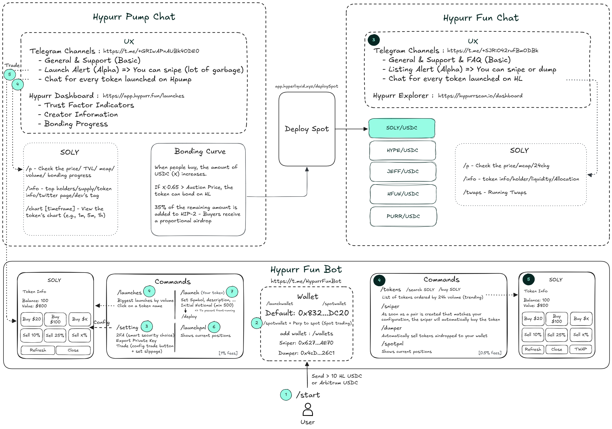

# Spot Deployments

## **How to Deploy Tokens on Hyperliquid**

There is only **one official method** to deploy a new token on Hyperliquid: a **Dutch Auction** that occurs every **31 hours**.

* **One ticker** is created at each auction interval.
* You must pay the required **gas cost** (Auction price) to win and **receive** the right to deploy your token.

_**Note:**_ HyperEVM enables builders to link ERC-20 tokens with spot tokens. However, without a native Hyperliquid ticker acquired via Dutch Auction, your token won’t appear on the front end or be traded on the order book.

***

### **1.** Official Deployment Interface

* Access the **official deployment interface** here: [https://app.hyperliquid.xyz/deploySpot](https://app.hyperliquid.xyz/deploySpot).
* For a more **comprehensive understanding** of the deployment process (or to launch your token), we recommend reading: [Spot Deployments (HIP-1, HIP-2)](../../architecture/hypercore/hips/spot-deployments-hip-1-hip-2.md).

***

### 2. Crowdfunding with Hpump

[**Loracle** ](https://x.com/laurentzeimes)offers a **pre-market** approach that integrates seamlessly with the Dutch Auction:

* **Traders** can trade an **unlimited number** of tokens before they’re officially listed.
* **Token creators** can rely on **automatic ticker purchase** once the token’s **TVL** meets the **auction price**—securing their token’s listing on Hyperliquid.

🚨 **Want to learn how to use Hypurr Fun and make the most of its features?**\
Check out the official guide here: [**Hypurr Fun Docs**](https://hypurr-fun.gitbook.io/hypurr-fun-docs).

***

### **Additional Resources**

Below is a **detailed diagram** summarizing all the key information. Feel free to **print** it or keep it **handy** while trading on **Hypurr Fun**.

<figure><figcaption></figcaption></figure>

For **more guides** on how to use the Hypurr Fun Bot and maximize its potential:

* [HL Trenches Ultimate Guide](https://l1ghtyear.notion.site/HL-Trenches-Ultimate-Guide-12f90df6c9b780b29adbdbd8717f86be)
* [Tips and strategies from @DegennQuant](https://x.com/degennQuant/status/1865755024816852996)
* [Step-by-step guide by @Jimihendrixgin](https://x.com/jimihendrixgin/status/1867770279847469437)

Before investing in or trading **listed tokens on Hyperliquid**, it’s essential to understand their history and potential risks. Some projects may be scams or poorly managed. The following resources provide detailed information on previously listed tokens:

* [General Overview on Notion (Pasteke)](https://0xpasteke.notion.site/68a1348a53c14e6fbd405036128037f5?v=26e777a949c34b6090b888ed20627295)
* [Spot Tokens Overview on Notion (ScroogeMcCoin)](https://scroogemccoin.notion.site/Hyperliquid-Spot-Tokens-df2f09de70f94fd2a761752a1ac71dc2)
* [Community-Compiled Spreadsheet of Tokens](https://docs.google.com/spreadsheets/d/1uDKdvamD6gOGPtzfyhjcY8eRsoXKm544v3uNu-f_H6o/edit?gid=0#gid=0)
