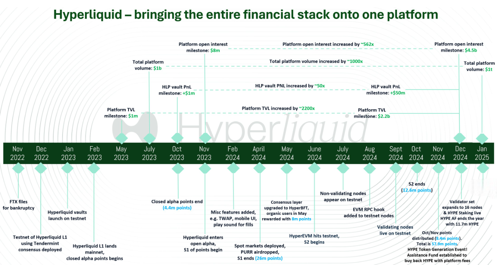

# Roadmap

### Hyperliquid Timeline

<figure><figcaption>
<a href="https://x.com/stevenyuntcap/status/1875221019356754143">Steven</a> Timeline
</figcaption></figure>

### Hype Token Launch

* **Points Distribution (27 Nov 2024)**: Points awarded for activity in May, October, and early November 2024, with 57.9M points distributed after anti-Sybil checks.
* **Genesis Launch (29 Nov 2024)**: $HYPE launched at $3, kicking off a new era for the ecosystem.

**Future Goals**

* **Expand Utility**: Grow $HYPE’s role in governance, staking perks, and ecosystem rewards like airdrops.
* **Incentivize Engagement**: Reward holders, stakers, and front-end users, with Season 3 (42.81% of incentives) likely tied to staking and builder code activity.
* **Drive Adoption**: Leverage price action and meme token momentum to boost awareness, as Jeff sees this as organic marketing.

### HyperBFT

* **Staking + Validators (30 Dec 2024)**: Staking launched on mainnet with over 400M $HYPE staked, and validators grew from 4 to 16.
* **Permissionless Validators (4 Mar 2025)**: Validator set became fully permissionless, with the top 20 stakers forming the active set.
* **Staking Tiers (19 Mar 2025)**: Tiers introduced, offering trading fee discounts based on $HYPE staked.
* **Non-Validator Nodes (6 Mar 2025)**: Anyone can run a non-validator node to support decentralization.

**Future Goals**

* **Full Decentralization**: Execute a multi-phase process to decentralize the network completely, a top priority for the next 6-12 months.

### HyperEVM

* **Launch (18 Feb 2025)**: HyperEVM launched on mainnet, enabling general-purpose programmability.
* **HyperCore/HyperEVM Link (25 Mar 2025)**: Seamless transfers and trading of HyperEVM tokens on HyperCore order books activated.

**Future Goals**.

* **Builder Empowerment**: Let developers tap into Hyperliquid’s deep liquidity permissionlessly, supporting billion-dollar apps.
* **Mass Adoption**: Enable millions of users to engage with Hyperliquid-powered products without noticing the blockchain.

### HyperCore

* **Multi-Sig (10 Feb 2025)**: Native multi-sig launched on mainnet, boosting security.
* **BTC Spot Trading (19 Feb 2025)**: BTC spot trading, deposits, and withdrawals enabled via Unit integration.

**Future Goals**

* **Performance Boost**: Continuously enhance L1 performance with high TPS and low latency via HyperBFT.
* **Financial Primitives**: Improve onchain spot/perp order books, vaults, oracles, and account abstractions.
* **Liquidity Leadership**: Maintain world-class, community-owned liquidity through HLP, with over $25M already redistributed.

### Builder Ecosystem

* **Builder Codes**: A native L1 primitive for monetizing applications, with some builders already earning >$100k/day onchain.
* **Vision**: Hyperliquid as the "AWS of crypto," providing scalable liquidity infrastructure for builders to own their stack and upside.

**Future Goals**

* **Billion-Dollar Apps**: Support multiple billion-dollar protocols by 2025, as predicted by Jeff, leveraging Hyperliquid’s liquidity.
* **DeFi Dominance**: Capture >50% of new DeFi project volume natively, offering CEX-level liquidity with blockchain accessibility.
* **Ecosystem Growth**: Expand builder codes to decentralize front-end access, incentivizing tools like @pvp\_dot\_trade for broader adoption.

***

#### Why This Matters

Hyperliquid’s 2024 achievements—$15B in 24-hour volume, no fees to middlemen, and a passionate, user-owned community—set the stage for 2025. Jeff’s focus is clear: decentralize the network, launch the HyperEVM, and make Hyperliquid the go-to liquidity infrastructure for builders. With no private investors and all revenue (like $25M from HLP) flowing back to users, this is a platform built for the long haul—aiming to onboard trillions in value as finance moves onchain.

***

_Stay tuned for updates and enjoy exploring the Hyperliquid ecosystem!_
