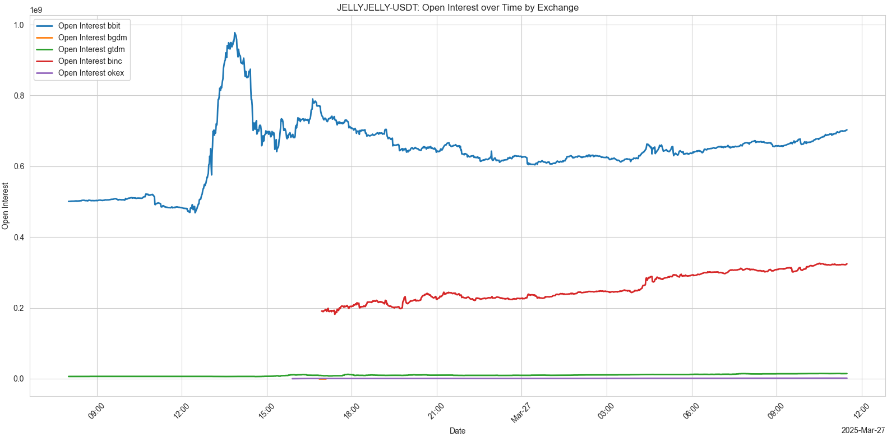

---
layout:
  title:
    visible: true
  description:
    visible: false
  tableOfContents:
    visible: true
  outline:
    visible: true
  pagination:
    visible: true
---

# 2025-26-03

## Hyperliquid Attack by the Numbers

On March 26, 2025, shortly after 12:50 UTC, Hyperliquid, a decentralized trading platform, fell victim to an attack targeting the JELLY token. The platform responded: “After evidence of suspicious market activity, the validator set convened and voted to delist JELLY perps.” This attack threatened the HLP vault, holding roughly $290 million, which could have been liquidated—severely impacting Hyperliquid’s long-term stability and operations.

***

### 1. **Timeline of Events (UTC)**

#### **Phase 0: Market Preparation** 📈📉

* **10:00 UTC**: The JELLY price pumped by **13%** until 10:50 UTC, then dumped back to its initial level by 12:15 UTC.
  * **Purpose**: Likely a test to gauge market reactions and liquidity ahead of the main attack.
* **12:15 UTC**: A significant **30% dump** occurred until 12:55 UTC, dropping the price from **$0.1287** to **$0.00831**.
  * **Purpose**: To establish a low price point, making it easier to liquidate positions later and target the HLP vault.

<figure><figcaption></figcaption></figure>

#### **Phase 1: Setting Up Delta-Neutral Positions** ⚖️

* **12:53:37 UTC**: The attackers opened massive **short positions** on JELLY perpetuals using the address [`0xde95...c91`](https://hypurrscan.io/address/0xde9593Fe5cDC5Cb0917f5d5618A111F1174f5c91).
  * **Transactions**:
    * [`0x49781a52...`](https://hypurrscan.io/tx/0x49781a526a636acaab5404204ebe7802027d0101377078018de125a7fa6cc582): Opened short for **-215,146,684 JELLY** at **$0.0095029** (value: **$2,044,513.28**).
    * [`0x819702a2...`](https://hypurrscan.io/tx/0x819702a256edfda8277b04204ebe7802027d006bf59863df1eed887143d0dadc): Opened short for **-215,146,684 JELLY** at **$0.0095041** (value: **$2,044,773.59**).
* To compensate and to be able to open these shorts, the attackers opened **long positions** on two other addresses (delta neutral):
  * **Address 1**: [`0x67fe...CA2`](https://hypurrscan.io/address/0x67fe6F372c2Bd7ce0AA660144568F80A7cD85CA2)
    * `0x49781a52...`: Opened long for **189,491,868 JELLY** at **$0.009503** (value: **$1,800,741.22**).
    * `0x819702a2...`: Opened long for **12,385,602 JELLY** at **$0.009503** (value: **$117,700.38**).
  * **Address 2**: [`0x20e8...808`](https://hypurrscan.io/address/0x20e8fD36dcdEF8DfbB983B0bc06c658105b9a808)
    * `0x49781a52...`: Opened long for **25,654,816 JELLY** at **$0.009502** (value: **$243,772.06**).
    * `0x819702a2...`: Opened long for **199,752,870 JELLY** at **$0.009503** (value: **$1,898,251.52**).

#### **Phase 2: Triggering Liquidation to Transfer Position to HLP** 💥

* **13:03:01 UTC**: The attackers request the **withdrawal** of all their available margin and **close** part of their short positions to intentionally trigger the **liquidation**.
  * **Transaction**: `0xea6bd894...` Closed short for **3,436,002 JELLY** at **-$0.073978** (value: **$254,189.26**).
* **13:03:44 UTC**: The attackers’ positions were liquidated, transferring a massive short position to the **HLP vault**.
  * **Liquidation Transaction**: `0x5f10925c...` Liquidated **-398,788,688 JELLY**.
* **13:04:59 UTC**: Attackers funds arrive on arbitrum.
  * **Withdrawal Transaction**: `0xcabfbe63...` Withdrew **2,762,742.63 USDC** to Arbitrum.
* **Result**: HLP now held a short position of **398,191,926 JELLY**, entered at **$0.011282**.

<figure><figcaption>
<a href="https://x.com/lookonchain/status/1904902828319269068/photo/2">Lookonchain</a> Screenshot
</figcaption></figure>

#### **Phase 3: Pumping the Market to Harm HLP** 📈

* **13:00 - 14:00 UTC**: The attackers pumped the JELLY price across Hyperliquid and other exchanges, driving it to **$0.05**—a **400% increase**.
  * **Purpose**: To inflict massive unrealized losses on HLP’s short position, destabilizing the vault.

<figure><figcaption>
A massive whale with 124.6M $JELLY($4.85M) is manipulating the price - <a href="https://x.com/lookonchain/status/1904922981073035498">tweet</a>
</figcaption></figure>

#### **Counterattack: Hyperliquid’s Response** 🛡️

* **\~15:00 UTC**: Hyperliquid Labs identified the attack and proposed a solution to protect the platform. A decentralized vote was held, with all validators approving within **2 minutes**.
* **15:15:46 UTC**: All JELLY positions were **settled at the opening price of $0.0095**, and the pair was delisted.
  * **Settlement Transaction**: `0x0ba58974...` Settled **-201,913,524 JELLY** at **$0.0095** (value: **$1,918,178.48**).
  * And so on.
* **15:47 UTC**: Hyperliquid released an official statement, promising to investigate and refund innocent users.

***

### 2. **Attackers’ Methods**

<figure><figcaption></figcaption></figure>

#### **Preparation Phase** 🛠️

Before the main attack on Hyperliquid on March 26, 2025, the attackers conducted multiple tests between **March 15** and **March 25**, 2025. These experiments aimed to understand Hyperliquid’s mechanics (withdrawals, liquidations, position management) and refine their strategy for the final assault. Here’s a breakdown of their key steps:

**First Test: Withdrawal and Market Pump Attempt 📈**

* **Address**: [0xde9593Fe5cDC5Cb0917f5d5618A111F1174f5c91](https://hypurrscan.io/address/0xde9593Fe5cDC5Cb0917f5d5618A111F1174f5c91)
* **Objective**: Test the withdrawal process and assess market impact without triggering liquidation.
* **Key Transactions**:
  * **March 15, 2025, 13:54:15 GMT**: Deposited **499,999.9 USDC** from Arbitrum (`0x8ea54dbc...`).
  * **March 15, 2025, 16:33:32 GMT**: Opened a small long position of **3,110 JELLY** at **$0.006464** (value: **$20.1**, `0x03f34b52...`).
  * **March 16, 2025, 09:40:53 GMT**: Closed the long position for **-3,110 JELLY** at **$0.013985** (value: **$43.49**, `0x9ead4b39...`).
  * **March 16, 2025, 09:45:01 GMT**: Withdrew **500,022.27 USDC** to Arbitrum (`0x8890de89...`).

**Second Test: Understanding Hyperliquid Mechanics 🔍**

* **Period**: March 17 to March 19, 2025
* **Objective**: Explore order types (limit, TWAP) and position handling on Hyperliquid.
* **Key Transactions**:
  * **March 17, 2025, 18:29:03 GMT**: Placed a limit order for **313,659 JELLY** at **$0.0295** (value: **$9,252.94**, `0xd0cdef54...`).
  * **March 19, 2025, 19:49:58 GMT**: Executed a TWAP for **-2,714,234 JELLY** at **$0.019151** (value: **$51,980.7**, `0x00000000...`).
  * **March 19, 2025, 20:01:27 GMT**: Closed a long position of **-25,638 JELLY** at **$0.0192** (value: **$492.25**, `0xec5def50...`).
* **Observation**: Realized the need to open opposing positions (long and short) across multiple addresses to disguise intent and avoid immediate liquidation.

**First Attack Attempt (Failed or Calibration Test) 🧪**

* **Period**: March 19 to March 25, 2025
* **Objective**: Test a small-scale attack or fine-tune their approach.
* **Key Actions**:
  * **Address 1**: [0xde9593Fe5cDC5Cb0917f5d5618A111F1174f5c91](https://hypurrscan.io/address/0xde9593Fe5cDC5Cb0917f5d5618A111F1174f5c91)
    * **March 20, 2025, 12:23:17 GMT**: Opened multiple long positions, starting with **2,389,589 JELLY** at **$0.016775** (value: **$40,084.68**, `0xce68b756...`).
  * **Address 2**: [0x67fe6F372c2Bd7ce0AA660144568F80A7cD85CA2](https://hypurrscan.io/address/0x67fe6F372c2Bd7ce0AA660144568F80A7cD85CA2)
    * **March 19, 2025, 15:58:35 GMT**: Deposited **99,999.88 USDC** from Arbitrum (`0x89b81b81...`).
    * **March 19, 2025, 17:55:29 GMT**: Deposited an additional **299,999.88 USDC** (`0xaf70f1ce...`).
    * **March 20, 2025, 16:02:23 GMT**: Opened multiple short position, starting with **-21,085 JELLY** at **$0.01825** (value: **$384.8**, `0x08a91ba9...`).
  * **Withdrawal Attempt**:
    * **March 21, 2025, 19:54:36 GMT**: Attempted to withdraw **703,436.63 USDC** from the long position address, likely to test margin levels or trigger liquidation.
    * **Result**: Liquidation failed. Long positions were gradually closed between March 22 and 25:
      * **March 22, 2025, 08:01:41 GMT**: Closed **-642,979 JELLY** at **$0.035195** (value: **$22,629.36**, `0xb8b48768...`).
      * **March 25, 2025, 09:50:20 GMT**: Final closure of **-25,705 JELLY** at **$0.016711** (value: **$429.56**, `0x5570ae01...`).
  * **Observation**: This failure helped the attackers understand liquidation thresholds and the timing required for successful withdrawals.

These lessons directly informed the "successful" attack on March 26, 2025, detailed in **1. Timeline**.

This preparation phase highlights meticulous planning and rigorous testing, critical to the attackers’ eventual success against Hyperliquid.

***

### **3. Market Impact Beyond Hyperliquid** 🌍

The attack on Hyperliquid exploited vulnerabilities in its oracle system by manipulating spot and perpetual (perp) markets on centralized exchanges (CEXs). This section details how these manipulations occurred, and analyzes the trading activity that enabled the attack. For a deeper dive into the oracle mechanics, check out the [Hyperliquid Oracle page](../../../architecture/hypercore/dex/oracle.md).

#### **Hyperliquid Oracle: A Quick Overview** 🔮

The Hyperliquid Oracle System provides critical price data for funding rates, margining, liquidations, and order triggers. Here’s a mini-summary, focusing on the exchange weights that made the attack possible:

* **Spot Oracle Price** 📈:
  * Updated every 3 seconds by validators.
  * Computed as a weighted median of prices from major CEXs:
    * **Weights**: Binance (3), OKX (2), **Bybit (2)**, Kraken (1), Kucoin (1), Gate IO (1), MEXC (1), Hyperliquid (1).
  * Validators submit prices, and the clearinghouse uses a weighted median based on their stake.
* **Mark Price** 📊:
  * A fair price estimate for perp contracts, combining:
    * Spot oracle price.
    * A 150-second EMA of the difference between Hyperliquid’s mid-price and the spot oracle price.
    * Hyperliquid’s order book median (best bid, best ask, last trade).
    * Median of perp mid-prices from Binance, OKX, and **Bybit**.
  * Used for liquidations, margin, and unrealized PnL.

**Key Takeaway**: Exchanges like Bybit (weight 2) heavily influence both the spot and mark prices, making them prime targets for manipulation.

#### **How the Attack Was Executed: External Market Manipulations** 🎯

The attackers manipulated CEX markets—especially Bybit—to skew Hyperliquid’s oracle price, triggering liquidations of the HLP vault’s short position. Here’s the analysis of what happened outside Hyperliquid, supported by graphs.

**Spot Market Activity 📉**

*   **Graph: Spot Volume Comparison (Bitget, Gate, Kucoin, Mexc)**

    * Shows a significant spike in spot trading volume on Gate and Bitget during this period (15-27). Nothing special on Kucoin and Mexc.

    <figure><figcaption></figcaption></figure>
*   **Graph: Number of Trades Over Time**

    <figure><figcaption></figcaption></figure>

**Perp Market Activity 📈**

*   **Graph: Perp Volume Across Exchanges (Bybit, Bitget, Gate, Binance)**

    * Bybit (bbit) led in trading volume, with Binance (binc) picking up later.
    * Bitget (bgdm) had high volume earlier but delisted its perp on March 22, 2025—odd timing.
    * Gate and Bitget spot are moderate compared to perp activity.

    <figure><figcaption></figcaption></figure>
*   **Graph: Open Interest (March 11-27)**

    * Bybit dominated open interest during the attack.
    * Open interest on Bybit started rising noticeably around 12:30.
    * Bitget had substantial open interest early on, but it dropped after the perp delisting on March 22. Wondering why they delisted the pair?

    <figure><figcaption></figcaption></figure>

    <figure><figcaption></figcaption></figure>
*   **Graph: Funding Rates Over Time**

    * Funding rates surged on Bybit starting around 13:30, likely reflecting a wave of long positions entering the market. Around 15:00, rates dropped sharply, possibly triggered by Hyperliquid delisting the pair.

    <figure><figcaption></figcaption></figure>
*   **Graph: 1% Market Depth (March 26)**

    * Bybit’s order book had the deepest liquidity, ideal for large-scale manipulation.

    <figure><figcaption></figcaption></figure>

    * _Note_: Further order book analysis is in progress.

**DEX Activity on Solana (Not Fully Studied) 🪐**

* I haven’t fully analyzed decentralized exchanges (DEXs) on Solana, but there was notable activity.
  * **Reference**: [Lookonchain’s post](https://x.com/lookonchain/status/1904922981073035498) highlights JELLY trading.
  * **Solscan Data**: [JELLY DeFi activities](https://solscan.io/account/Hc8gNSMaQiahiRiGjUfTaW8AXudRJHeGoeGpAn8WRcwq#defiactivities) show significant transactions during this period.

**Additional Suspicious Activity:**

* The HLP vault dropped from **$295M to $288M** just one day before the attack, raising questions about potential coordination or insider knowledge.
* A trader took a short position on HYPE beforehand: [0xc7C87046D9e147B14CC773BF3f865FebfB966EA4](https://hypurrscan.io/address/0xc7C87046D9e147B14CC773BF3f865FebfB966EA4).

#### **Why Bybit Was the Linchpin** 🔑

The attackers zeroed in on Bybit for these reasons:

* **Oracle Influence**: Bybit’s weight of 2 in the spot oracle gave it outsized impact on the price feed.
* **Mark Price Role**: Bybit’s perp mid-price feeds directly into Hyperliquid’s mark price calculation.
* **Liquidity**: Bybit’s deep order book allowed massive trades with minimal slippage.
* **Limited Competition**: This impact was amplified since major exchanges like Binance, OKEx, and Kraken didn’t list JELLY, leaving Bybit and smaller platforms to dominate the pricing.

**Smaller Players**: Kucoin, Gate IO, and MEXC (all weight 1) saw some activity, but their impact was minor compared to Bybit.

**Mechanism**: By pumping JELLY’s price on Bybit’s perp markets, the attackers distorted the oracle price, which flowed into Hyperliquid’s mark price and triggered liquidations.

***

### 4. CEX Reactions and Market Response

The attack prompted strong reactions from centralized exchanges, particularly criticism of Hyperliquid's handling of the incident.

**Bitget's Criticism:** Bitget CEO [Gracy Chen](https://x.com/GracyBitget/status/1904941729834557453) publicly criticized Hyperliquid, calling it potentially "FTX 2.0" and describing their response as "immature, unethical, and unprofessional." She argued that forcing settlement at favorable prices set a dangerous precedent and questioned the platform's integrity.

**Market Timing Suspicions:** Notably, major CEXs launched JELLY trading during the attack:

* **Binance:** Listed JELLY perpetual contracts at 16:00 UTC on [March 26](https://www.binance.com/en/support/announcement/detail/815acb27cc2146d2b3f2a4fe933f11d9) (during the incident)
* **OKX:** Launched JELLY trading at [15:30 UTC](https://www.okx.com/fr/trade-swap/jellyjelly-usdt-swap) the same day

**The Ultimate Irony:** Less than a month later, [Bitget suffered](https://x.com/Crypto_Jargon/status/1914224785770336364) a $100M+ loss due to a glitched trading bot creating arbitrage loops on VOXEL trading. Meanwhile, [Binance](https://x.com/RBCHI/status/1907048126088884418) quietly updated leverage and margin tiers on tokens like ACT, causing a whale liquidation of $3.79M and a 50%+ price crash - yet faced no criticism for this unilateral decision affecting users' positions.

This sequence of events highlighted the hypocrisy of CEX criticism while demonstrating their own operational risks and potential market manipulation tactics.

***

### 5. **Conclusion and Solutions for Hyperliquid**

Hyperliquid successfully thwarted a highly significant attack, reacting with **remarkable speed** while upholding its commitment to decentralization.

Some centralized exchanges (CEXs) criticized Hyperliquid’s approach, but their response was exemplary; they stayed true to their principles without compromising. How many CEXs [act against their clients](https://x.com/chameleon_jeff/status/1643610595848261632), executing questionable liquidations or manipulating markets? In contrast, Hyperliquid’s transparency and decentralized governance shone through, ensuring fairness for all users.

This incident, while challenging, will make Hyperliquid stronger. The platform [implemented](https://x.com/HyperliquidX/status/1905319339991204263) comprehensive solutions:

**Immediate Measures:**

* **User Protection:** JELLY long position holders refunded by Foundation at advantageous settlement price (0.037555)
* **HLP Vault Security:** Liquidator vault capped to small percentage of total HLP balance with isolated collateral
* **ADL Enhancement:** Triggers when Liquidator losses exceed threshold, preventing automatic collateral sharing between component vaults

**Governance Improvements:**

* **Onchain Delisting:** Validators vote to delist assets falling below thresholds
* **Dynamic OI Caps:** Refined to scale with market capitalization rather than fixed limits

**Long-term Solutions:**

* **Margin Tiers:** Launched [May 22, 2025](https://discord.com/channels/1029781241702129716/1030197017655394447/1374630391532486798), dynamically adjusting maximum leverage based on position size - helping address a key vulnerability of fixed leverage that was previously exploited.

Hyperliquid’s ability to navigate this crisis while remaining true to its decentralized ethos sets a powerful example in the DeFi space. With these lessons learned, the AWS of liquidity lies ahead of us. 🚀

Hyperliquid.

***
