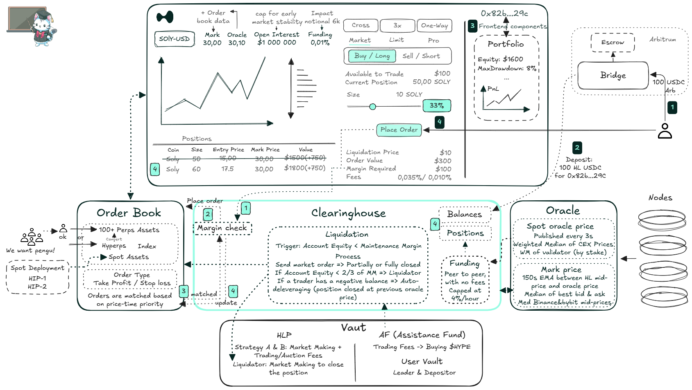

# HyperCore

_**Note:** The information in this page is based on the_ [_official Hyperliquid L1 documentation_](https://hyperliquid.gitbook.io/hyperliquid-docs/hyperliquid-l1)_. The **source code** of the L1 is **not yet publicly available**, so all details here are subject to change as the project evolves._

***

Hyperliquid is purpose-built to meet the rigorous demands of an on-chain derivatives exchange. Its architecture enables decentralized trading with unprecedented speed and throughput, setting it apart from more generalized blockchain solutions.

#### System Overview

Below is a diagram illustrating the general functionality of HyperCore (=Hyperliquid L1), showcasing its key components and how they interact to deliver high-performance, scalable trading infrastructure:

<figure><figcaption></figcaption></figure>
