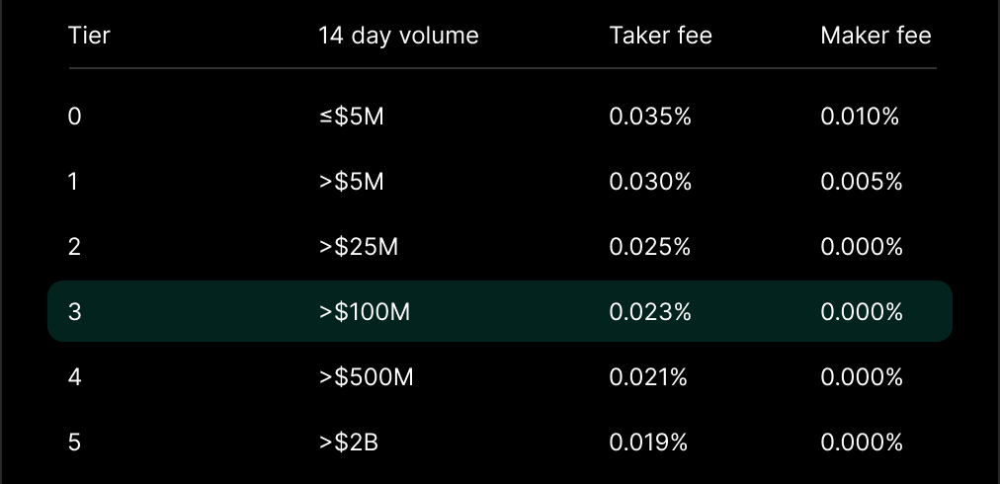
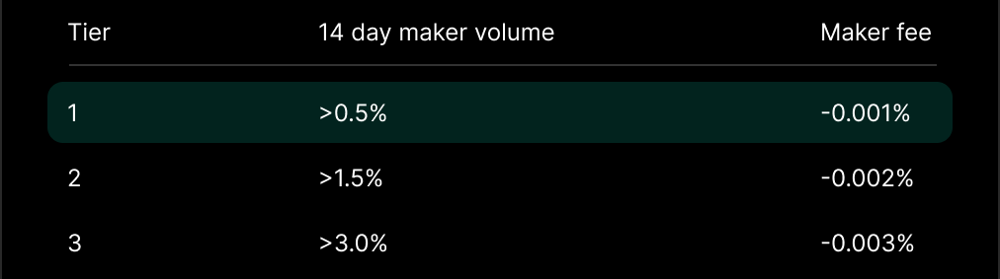

---
layout:
  title:
    visible: true
  description:
    visible: false
  tableOfContents:
    visible: true
  outline:
    visible: true
  pagination:
    visible: true
---

# Fees

Hyperliquid’s fee system is designed to reward active traders, referral users, and the broader community. By leveraging volume-based discounts and referral incentives, the platform ensures that participation benefits users while funding the ecosystem’s development.

***

### **Fee Tiers** 📊

Hyperliquid employs a **VIP tier system** and **Market Maker tiers** to calculate taker and maker fees based on trading volume. Fees are dynamically adjusted based on the last **14 days of volume**, ensuring fairness and scalability for all traders.

#### VIP Tiers

<figure><figcaption></figcaption></figure>

#### Market Maker Tiers

<figure><figcaption></figcaption></figure>

Market makers benefit from lower fees through the **Market Maker tier system** (see chart above). Hyperliquid offers no special programs or rebates—**anyone can participate**. Tools and support: [Python SDK](https://github.com/hyperliquid-dex/hyperliquid-python-sdk) | [#api-traders Discord](https://discord.gg/hyperliquid).

***

### **Referral Program** 🎁

Hyperliquid incentivizes user growth with its robust referral program, enabling traders to earn rewards by inviting others to the platform.

#### **How to Refer**

* Create your referral code on [Hyperliquid Referrals](https://app.hyperliquid.xyz/referrals) after completing **$10,000 in trading volume**.
* Share your unique link: _https://app.hyperliquid.xyz/join/YOURCODE_

#### **Referral Rewards**

* **Referrers Earn:** 10% of referred users’ fees, adjusted for any discounts they receive.
* **Referred Users Benefit:** Receive a **4% fee discount** on their first **$25M of volume**.

**Note:** Referral discounts do not apply to vaults or sub-accounts, as these are treated independently in the clearinghouse.

***

### **Community Fee Distribution** 🤝

* **All fees benefit the community**, supporting:
  * The **HLP (Hyperliquid Liquidity Provider)** program.
  * The **Assistance Fund**, which protects and stabilizes the ecosystem.
* The assistance fund is primarily held in **HYPE**, Hyperliquid’s native asset, and managed with validator oversight.

***

### **Key Highlights** 🌟

* Traders benefit from **volume-based discounts** and **referral rewards** to reduce costs.
* Makers can earn rebates while takers enjoy competitive fees that scale with activity.
* Fees directly fund the community, fostering a sustainable and user-centric ecosystem.
